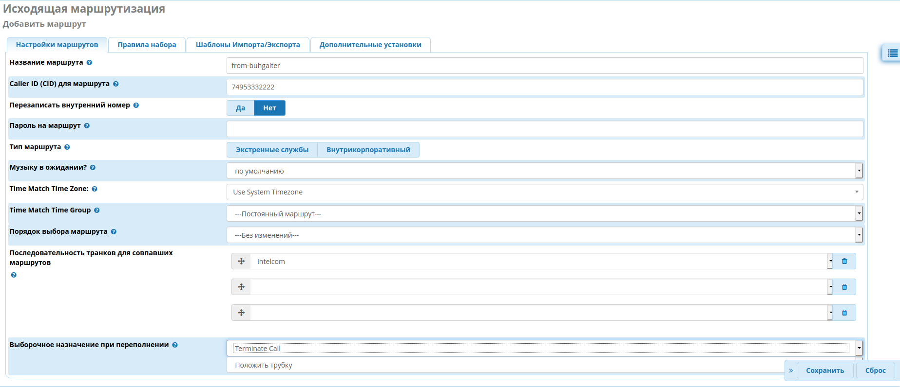
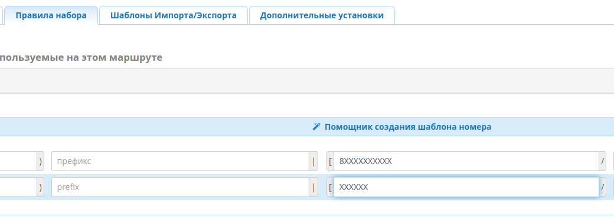
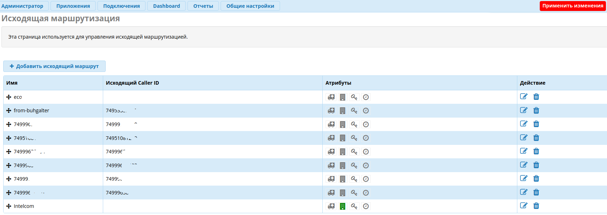

+++
title = 'Задание определенного направления (выход через конкретный транк)'
date = 2024-10-31T16:00:19+05:00
draft = false
+++
# Задание определенного направления (выход через конкретный транк)

Для начала создаем нужный нам маршрут: **Подключения → Исходящая маршрутизация**.

### 

Задаем произвольно описание , необходимый нам CallerID и транк, через который будет передаваться вызов с этим CallerID (если транк с регистрацией и допустим только один CallerID, то можно указать «**Форсировать использование транкового CID (Force Trunk CID) в настройках транка**»)

### 

Задаем необходимые (допустимые) нам шаблоны набора номеров:

Можете включить запись вызова:

После этого обязательно **Сохраняем** и **Применяем изменения.**

Как видим — появился новый маршрут в исходящих маршрутах.

Ещё будет неплохо поместить его в самый низ по приоритету маршрутов — чтобы не мешал остальным номерам.

Теперь отправляемся в **Подключения** → **Custom Contexts** и создаем новый контекст:

Жмем **Submit** и после этого он раскрывается:

### В меню **See All To**: выбираем **Deny**, т.е. запретим всё, а после разрешим необходимое.

Теперь рассмотрим и повключаем необходимое:

### **Default Internal Context**

- *Call Parking* — отвечает за парковку вызовов

- *Custom Internal Dialplan* — отвечает за использование контекста from-internal-custom.

### **Internal Dialplan**

Тут как правило по использованию приложений:

- *app-callwaiting-cwoff* и *app-callwaiting-cwon* — позволяет использовать включение и отключение Call Waiting;

- *ext-meetme* — приложение конференции;

- *app-fmf-toggle, ext-findmefollow* и *fmgrps* — относятся к модулям Follow-Me и Find-Me;

- *app-calltrace* — трассировка вызова (из Сервисных кодов);

- *app-blacklist* — использование приложения Черный список;

- *app-echo-test* — Эхо-тест;

- *app-speakextennum* — Произношение вашего внутреннего номера;

- *app-speakingclock* — Говорящие часы;

- *app-recordings* — не уверен, но скорее всего Запись входящего звонка по необходимости;

- *ext-queues* — Приложение очередей (позволяет набирать очередь по внутреннему номеру);

- *ext-group* — Набор групп вызова напрямую;

- *app-dialvm* и *app-vmmain* — позволяют проверять и оставлять голосовую почту соответственно;

- *ext-local-confirm* — использование опции Подтверждать вызовы;

- *findmefollow-ringallv2* — до конца неясно, но похоже на использование стратегии обзвона ringallv2 для Следуйте-Сюда/Найди-меня;

- *app-pickup* — разрешает использование Назначенного перехвата звонка;

- *app-chanspy* — использование Шпионского канала;

- *ext-test* — судя по диалплану — это Симуляция входящего звонка;

- *ext-local* позволяет вызывать внутренние номера.

Так что если хотите запретить всё, кроме вызова внутренних номеров — разрешайте только *ext-local*.

### **Outbound Routes**

Вот здесь и выбираем созданный нами маршрут *from-buhgalter*. Можно выбрать и другие разрешенные маршруты и расположить их в порядке возрастания совпадения (по приоритетам: чем ниже значение — тем выше в списке и тем выше приоритет).

При этом напротив **ALL OUTBOUND ROUTES** должно стоять **Deny**.

С охраняем созданный пользовательский контекст.

И теперь нам осталось применить его к внутреннему номеру.

Нужная нам настройка на вкладке **Расширенный**.

Вот здесь напротив **Custom Context** и выбираем наш созданный пользовательский контекст **from-buhgalter**.

Сохраняем и применяем настройки.

Теперь пользователю будет разрешено звонить туда, куда мы определили для него.